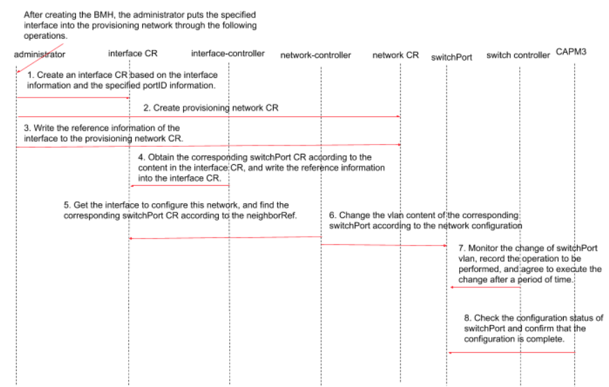
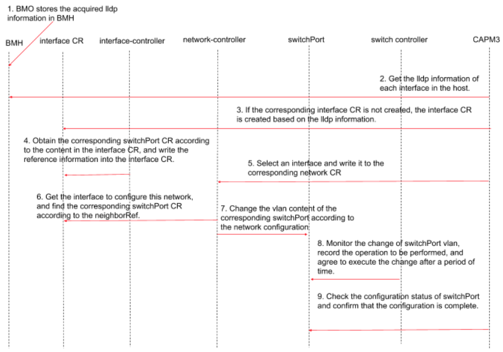

# Automatic network configuration

## Status
provisional

## Summary
This proposal is to expand the scope of Metal³ to include an API to manage
physical network devices.

## Motivation
Metal³ follows the paradigm of Kubernetes Native Infrastructure (KNI), which is
an approach to use Kubernetes to manage underlying infrastructure.
Managing the configuration of some physical network devices is closely related
to managing physical hosts.

As bare metal hosts are provisioned or later repurposed, there may be
corresponding physical network changes that must be made, such as reconfiguring
a ToR switch port. If the provisioning of the physical host is managed through
a Kubernetes API, it would be convenient to be able to reconfigure related
network devices using a similar API.

### Goals
- Define a Kubernetes API for configuring network switches.
- Automatically configure the network infrastructure for a host when adding it
  to a cluster.

### Non-Goals
- Add new Switch API to BMO.

## Proposal
This document proposes to add a new mechanic to automatically perform physical
network device configuration before provisioning a BareMetalHost.
It contains 4 new objects (Switch, SwitchPort, Interface and Network object), 3
new controllers (Switch controller, Interface controller and Network
controller) and related changes to current code including CAPM3, BareMetal
Operator, Metal3Cluster and BareMetalHost.

### User Stories

#### Story 1
As a consumer of Metal³, when adding a machine resource to the cluster, it can
automatically put the adapted BMH into the correct Switch's VLAN.

#### Story 2
As a user/admin a SmartNIC that is hosted in a BMH needs to be provisioned,
pre-configured, and then capable of in operation management.

#### Story 3
As an admin, when creating a new machine, it is possible to automate configure
LAG/mLAG.

#### Story 4
As an admin, when creating a cluster, it is possible to configure ACL settings
in a switch for each bare metal server according to its functionality.
The ACL setting:
- Direction: ingress or egress
- Protocol: SSH, HTTP, …all
- Action: allow, deny
- Port status: up, down (status of the switch port)

## Design Details

Resources and controllers scheduled to be added and modified in the current
design:
- Switch CRD:
  - Switch CR represents a physical switch. It contains the system information
    (vendor, OS, ...) and the access information of the switch.
- SwitchPort CRD:
  - SwitchPort CR represents one port in a switch. It contains the
    configuration information of a normal port on the switch, the connection
    information, the information of the switch to which it belongs, and a field
    indicating whether the configuration is completed.
- Switch controller:
  - Monitors the above two resources, collects all the changes in all
    SwitchPort CRs, configures the switch, and sets the field where the
    SwitchPort configuration is completed.
- Network CRD:
  - Contains the network configuration of the cluster and the references
    referring to which interfaces are currently using this network
    configuration.
- Network controller:
  - Monitors Network CRs, when there is a new interface using the configuration
    defined by a Network CR, changes the corresponding SwitchPort CR vlan
    configuration.
- Interface CRD:
  - Interface CR represents a network interface, this can be a NIC in a bare
    metal machine. It contains device information, LLDP information including
    the connected switch’s mac address and the switch portID of the link, and
    the reference referring to the device which this interface is connected to.
- Interface controller:
  - Monitors Interface CRs. When there is a new Interface CR, find the
    corresponding SwitchPort CR according to the provided information and store
    the reference of that SwitchPort CR in the Interface CR.
- CAPM3:
  - Gets the LLDP information of all the interfaces in the host. If there is no
    corresponding Interface CR, create one.
  - If a host has multiple interfaces, selects one for network configuration.
  - Queries the configuration status of the SwitchPort CR to ensure that the
    configuration is successful before provisioning.

The main implementation process is described below:
- After creating a BMH, the administrator puts an interface into the
  provisioning network.

  

- After an Interface is put into the provisioning network, the LLDP information
  of other interfaces can be obtained and network configuration can be
  performed.

  

The workflow of a basic user story:
- Administrator:
  - Creates a Network resource used as provisioning network.
  - Creates BMH CRs. Need to know the following information about BMH:
    - Info of the interface which will be connected to the provisioning
      network.
    - Info of the switch port connected to this interface.
  - Creates an Interface CR for each BMH based on the above information.
    - The Interface controller monitors the Interface CR, finds the
      corresponding SwitchPort CR according to the switch port information, and
      fills it in `.spec.neighborRef` in the Interface CR.
  - Adds the Interface CR information to `.spec.interfaces` in the provisioning
    Network CR.
    - The Network controller watches Network CRs and for each interfaces in its
      `.spec.interfaces`, the controller will modify the corresponding
      SwitchPort CR to match the network configuration.
    - The Switch controller will configure the switch based on the SwitchPort
      CR.
    - After the switch configuration is completed, the BMH is connected to the
      provisioning network. Ironic will perform introspection and update the
      status of the BMH. The `.status.hardware.nics` in the BMH CR will contain
      the LLDP information collected on each NICs.
    - CAPM3 monitors BMH CRs and obtains the information of each interface
      stored in `.status.hardware.nics`. CAPM3 will also create the
      corresponding Interface CR if it is not created.
- User:
  - Creates production Network CRs.
  - Creates a Cluster and specify its `.spec.networkRef`.
    - CAPM3 finds a ready BMH.
    - CAPM3 selects an Interface from the Interface CRs owned by this BMH to
      connect to the network specified by the user.
    - CAPM3 writes the chosen Interface CR information into the Network CR.
    - Network Controller and Switch Controller will complete the automatic
      configuration of the switch.
    - After CAPM3 observes that the SwitchPort configuration is complete, it
      triggers provisioning via the provisioning network.
    - When the provisioning is completed, CAPM3 removes the bmh's Interface for
      provisioning from the provisioning Network CR, thus disconnecting the BMH
      from the provisioning network.

### Changes to Current API

#### Metal3Cluster CRD
Add a `networkRef` field to `.spec` to point to the corresponding Network
resource.

```yaml
Spec:
 ...
 networkRef: sample-network
 ...
```

#### CAPM3
- Before BareMetalHost provisioning, CAPM3 obtains all the NICs information. If
  the corresponding Interface CR has not been created, it will create one.
- If a BMH has multiple interfaces, CAPM3 selects one to use.
- Writes the ref information of the selected Interface into `.spec.interfaces`
  in the corresponding Network CR.
- Checks the configuration status of the SwitchPort CR corresponding to the
  selected Interface CR to ensure that the network configuration is successful,
  and then proceed with the provisioning operation.

#### BareMetal Operator
- BMO obtains LLDP information (include ID of the port in switch and
  information of vlan active on that port) which is collected by IPA during the
  inspection process.
- BMO stores the information of bare metal server’s NICs in the status of BMH
  CR. The status of each NICs includes its name, mac address and LLDP
  information.

#### BMH CRD
Add a field containing LLDP information in `.status.hardware.nics`.
```yaml
 status:
 …
 hardware:
 …
 nics:
   // The following data is obtained by Baremetal Operator and
   // filled with each lldp information.
   - name: eth0
     ...
     lldp:
   - name: eth1
     ...
```

### Add new CRD and controller

#### Interface CRD
```yaml
apiVersion: network.metal3.io/v1alpha1
kind: Interface
metaData:
  name: bm0-eth0
spec:
  portID: 10
  switchMacAddress: XX.XX.XX.XX
  neighborRef:
    - kind:
      apiVersion:
      namespace:
      name:
```

#### Interface Controller
- Watch
  - Interface CR
- Configuration Operations
  - Whenever a new Interface CR is created, Interface Controller will find the
    corresponding SwitchPort CR according to `.spec.portID` and
    `.spec.switchMacaddress`, and write the reference of the SwitchPort CR into
    `spec.neighborRef`.

#### Network CRD

```yaml
apiVersion: network.metal3.io/v1alpha1
kind: Network
metaData:
  name: sample-network
spec:
  networkType: physicalSwitch
  // The VLANs available
  vlans:
    - id:
    - id:
  // The untagged VLAN ID
  vlanId:
  interfaces:
    - name: bm0-eth0
    - name: bm1-eth1
```

#### Network Controller
- Watch
  - Network CR
- Configuration Operations
  - When the network configuration is changed, finds the corresponding
    SwitchPort CR according to `.spec.neighborRef` in each Interface CR which
    is stored in `.spec.interfaces` in the Network CR. Then changes the spec of
    all the SwitchPort CRs.
  - When `.spec.interfaces` increases, finds the corresponding Interface CR,
    and then finds the corresponding SwitchPort CR, and write configuration to
    that SwitchPort CR.

#### Switch CRD
The Switch CR is used to store the specific information of the switch including
its name and access details.
```yaml
apiVersion: switch.metal3.io/v1alpha1
kind: Switch
metadata:
  name: example-switch
spec:
  accessDetail:
    ip: 192.0.0.1
    OS: fos
    port: 22
    // Store the username and password of the switch
    // in the form of secret
    accessSecret: example-switch-secret
```

#### SwitchPort CRD
SwitchPort CR contains the desired configuration and current status of a
specific port in a switch.
```yaml
apiVersion: switch.metal3.io/v1alpha1
kind: SwitchPort
metadata:
  name: example-switchport
spec:
  portId: 10
  // vlans indicates the vlan information to be changed to.
  // Changed by network controller.
  // The VLANs available
  vlans:
    - id:
    - id:
  // The untagged VLAN ID
  vlanId:
  ownerRef:
    name: sample-switch
status:
  // ConfigurationStatus indicates whether the switchPort is
  // configured. When the network controller modifies the vlan
  // information, it will set this value to notready.
  // After the switch controller configuration is complete,
  // this value will be set to ready.
  ConfigurationStatus: ready
```

#### Switch Controller

- Watch
  - Switch CR
  - SwitchPort CR
- Configuration Operations
  - When a new Switch CR is created, Switch Controller obtains all the ports of
    the switch and their corresponding VLAN information, and creates a
    SwitchPort CR for each port.
  - When a SwitchPort CR's network configuration changes, Switch Controller
    configures the corresponding port of the switch and sets
    `.status.configurationStatus` to `ready` if it observed that the
    configuration in the switch matches the spec of the SwitchPort CR.

### Implementation Details/Notes/Constraints

TBD

### Risks and Mitigations

TBD

### Work Items
- Define the Switch, SwitchPort, Network and Interface CRD
- Implementation of Switch, Network and Interface Controller
- Change the API of Metal3Cluster and BareMetalHost
- Unit tests
- E2e tests in metal3-dev-env

### Dependencies

NONE

### Test Plan

- Unit tests for all the cases should be in place.
- e2e testing in Metal3-dev-env.

## Drawbacks

NONE

## Alternatives

NONE

## References
- [issue](https://github.com/metal3-io/baremetal-operator/issues/570)
- [physical-network-api-prototype](https://github.com/metal3-io/metal3-docs/blob/master/design/physical-network-api-prototype.md)
