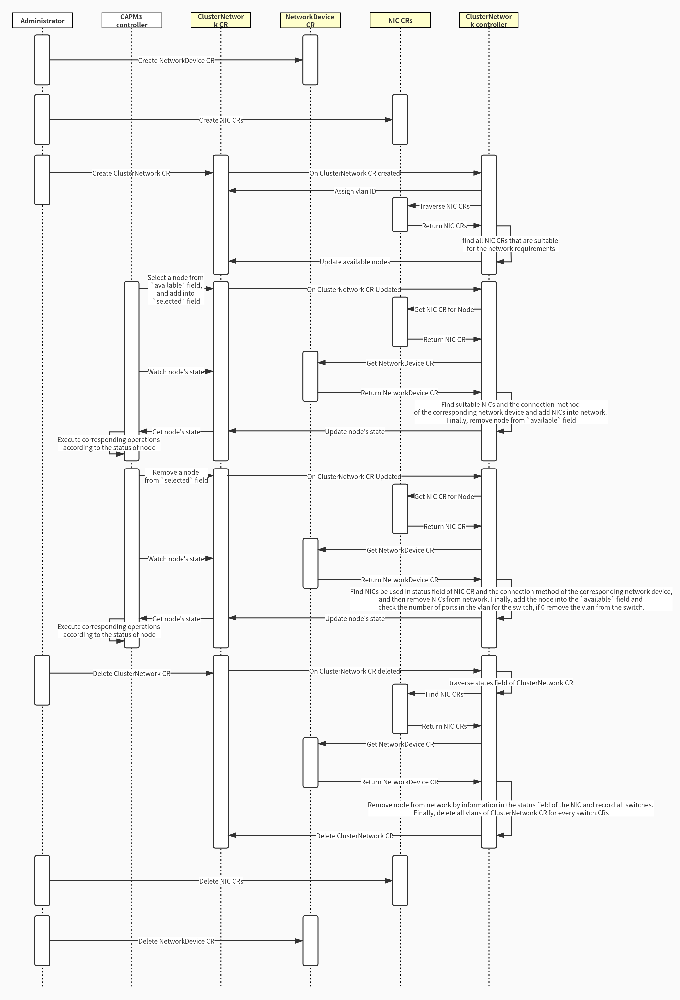

# Automatic network configuration

## Status

provisional

## Summary

This proposal is to expand the scope of Metal³ to include an API to manage physical network devices.

## Motivation

Metal³ follows the paradigm of Kubernetes Native Infrastructure (KNI), which is an approach to use Kubernetes to manage underlying infrastructure. Managing the configuration of some physical network devices is closely related to managing physical hosts.

As bare metal hosts are provisioned or later repurposed, there may be corresponding physical network changes that must be made, such as reconfiguring a ToR switch port. If the provisioning of the physical host is managed through a Kubernetes API, it would be convenient to be able to reconfigure related network devices using a similar API.

### Goals

- Define a Kubernetes API for configuring network switches.
- Automatically configure the network infrastructure for a host when adding it to a cluster.
- Do network configuration when deprovisioning the hosts.
- Design a network abstraction that can represent any of the target networking configuration, independently of the controller used.


### Non-Goals

- implement a network controller, this is aimed at being an integration with an existing controller only.
- implement a solution for a specific underlying infrastructure.


## Proposal

This document proposes to add a new mechanic to automatically perform physical network device configuration before provisioning a BareMetalHost. And the processing of the BMH network after provisioning. It contains 3 new objects (NetWorkDevice, ClusterNetwork, NIC), a new controller (ClusterNetwork) and related changes to current code including Metal3Cluster.

### User Stories

#### Story 1

As a consumer of Metal³, when adding a machine resource to the cluster, according to the network configuration of the cluster, the corresponding BMH is automatically configured to the corresponding network.

#### Story 2

As a consumer of Metal³, when a machine is deleted from the cluster, the corresponding network configuration is automatically deleted.

#### Story 3

As a user/admin a SmartNIC that is hosted in a BMH needs to be provisioned, pre-configured, and then capable of in operation management.

Physical server(OS) -----> SmartNIC [virtual switch(OVS) ---> physical NIC] ←-- (LAN cable)-----> PortID

#### Story 4

As an admin, when creating a new machine, it is possible to automate configure LAG/mLAG.

#### Story 5

As an admin, when creating a cluster, it is possible to configure ACL settings in a switch for each bare metal server according to its functionality. The ACL setting:
- Direction: ingress or egress
- Protocol: SSH, HTTP, …all
- Action: allow, deny
- Port status: up, down (status of the switch port)


## Design Details

Resources and controllers scheduled to be added and modified in the current design:

1. NetWorkDevice CRD
    - NetWorkDevice CR contains all network devices under the same network. It contains the system information (vendor, OS, ...) and the access information of these network devices.
2. ClusterNetwork CRD
    - ClusterNetwork CR describes some networks needed by cluster.
3. NIC CRD
    - NIC CR contains the information of the network card of the node and the corresponding relationship of the network devices.
4. ClusterNetwork controller
    - Managing the ClusterNetwork CR, maintaining the status field of the ClusterNetwork CR, and adding the owner fields of the NIC CR that can match the ClusterNetwork CR to the available field of the ClusterNetwork CR.
    - Monitor changes in the ClusterNetwork CR and configure the network.
5. CAPM3:
    - Read the available field of the ClusterNetwork CR, and select a BMH to add to the selected field of the ClusterNetwork CR.
    - Monitor the states field of the ClusterNetwork CR, check the state of the corresponding BMH, if the state is ready, continue to configure, if the state is error, delete the BMH from the selected field of the ClusterNetwork CR then perform the previous step.

### Changes to Current API

#### Metal3Cluster CRD

Add a `clusterNetwork` field to `.spec` to point to the corresponding Network resource.

```yaml
Spec:
 ...
 clusterNetwork: CN1
 ...
```

#### CAPM3

- CAPM3 will read the ClusterNetwork CR and get a BareMetalHost from the `available` field of ClusterNetwork CR.
- Add BareMetalHost into the `selected` field.
- Watch the Network configuration status of BareMetalHost in the `states` field of ClusterNetwork CR to ensure that the network configuration is successful, and then proceed with the provisioning operation.

### Add new CRD and controller

#### NetWorkDevice CRD

```yaml
metadata:
    name: ND1
spec:
    # More device types can be expanded as needed in the future.
    switch:
          # The device name must be unique among devices of the same type.
        - name: switch1
          user: root
          pwd: 1234
          ip: 192.168.0.1
          port: 20
          networkOS: fos
        - name: switch2
          user: root
          pwd: 1234
          ip: 192.168.1.1
          port: 20
          networkOS: fos
```

#### ClusterNetwork CRD

```yaml
metadata:
    name: CN1
    netWorkDevice: ND1
spec:
    network:
        - name: control
          # Rules of access control list.
          acl:
          # Network type, such as vlan vxlan etc.
          type: vlan
          # What kind of device is used for network.
          networkDeviceType: switch
          # The number of ports that need link aggregation.
          # Equal to the number of network cards required.
          linkAggregation: 2
          # For the performance requirements of the network card,
          # if there are multiple network cards that meet the requirements,
          # the lowest performance is preferred.
          nicHint:
              speed: 1000
              smartNIC: false
        - name: data
          type: vlan
          networkDeviceType: switch
          nicHint:
              speed: 1000
              smartNIC: true
status:
    network:
        - name: control
          # Vlan ID assigned by the controller.
          vlanID: 1001
        - name: data
          vlanID: 1002
    # Available nodes, maintained by the ClusterNetwork controller.
    available: map[bm1:NIC2,bm2:NIC3,sw0:NIC10,sw1:NIC11]
    # Selected nodes.
    selected: [bm0]
    # The states of the selected nodes.
    states:  map[bm0:{NIC0,ready}]
```

#### NIC CRD

```yaml
metaldata:
    # The name of nic CR.
    name: NIC0
    networkDevice: ND1
    # Node name corresponding to NIC CR.
    node: bm0
spec:
    nic:
          # Network device information connected to the network card (in NetWorkDevice CR).
        - networkDevice:
            switch:
              name: switch1
              port: 1
          # The capability of the network card.
          capability:
              speed: 1000
              smartNIC: false
        - networkDevice:
            switch:
              name: switch2
              port: 2
          capability:
              speed: 1000
              smartNIC: false
        - networkDevice:
            switch:
              name: switch2
              port: 1
          capability:
              speed: 1500
              smartNIC: false
        - networkDevice:
            switch:
              name: switch2
              port: 2
          capability:
              speed: 1500
              smartNIC: true
# When the NIC CR is selected by a ClusterNetwork CR,
# the NetWorkDevice controller fills in this field.
status:
    # The NIC CR is used by which ClusterNetwork CR.
    clusterNetwork: CN1
    nic:
        # The network information of the network card is configured,
        # fill in nil if it is not configured.
        - network: control
          vlanID: 1001
        - network: control
          vlanID: 1001
        - network: data
          vlanID: 1002
        - nil
```

#### ClusterNetwork controller

- Watch
    - ClusterNetwork CR
- Configuration Operations
    - When ClusterNetwork CR is created. ClusterNetwork controller will assign vlan ID to each network, then traverse NIC CRs to find all NIC CRs that are suitable for the network requirements, and store the name of the NIC CR and the `node` field in the `available` field of the ClusterNetwork CR.
    - When add a node in the `available` field of ClusterNetwork CR into the `selected` field. The ClusterNetwork controller will configure the network for the selected node, return the result in the `states` field, and fill the `status` field of the NIC CR, then remove the node from the `available` field.
    - When remove a node from the `selected` field. The ClusterNetwork controller will find the NIC CR's name of the node in the `state` field, then remove the node from network by the `status` field of NIC CR, and clean the `status` field of NIC CR, remove the node's state from the `states` field in ClusterNetwork CR. Finally, add the node into the `available` field and check the number of ports in the vlan for the switch, if 0 remove the vlan from the switch.
    - When delete ClusterNetwork CR, traverse states field and find NIC CR, remove node from network by information in the status field of the NIC CRs and record all switches. Finally, delete all vlans of ClusterNetwork CR for every switch.



### Implementation Details/Notes/Constraints

TBD

### Risks and Mitigations

TBD

### Work Items

- Define the Switch, SwitchPort, Network and Interface CRD
- Implementation of Switch, Network and Interface Controller
- Change the API of Metal3Cluster and BareMetalHost
- Unit tests
- E2e tests in metal3-dev-env

### Dependencies

NONE

### Test Plan

- Unit tests for all the cases should be in place.
- e2e testing in Metal3-dev-env.

## Drawbacks

NONE

## Alternatives

NONE

## References
- [issue](https://github.com/metal3-io/baremetal-operator/issues/570)
- [physical-network-api-prototype](https://github.com/metal3-io/metal3-docs/blob/master/design/physical-network-api-prototype.md)
